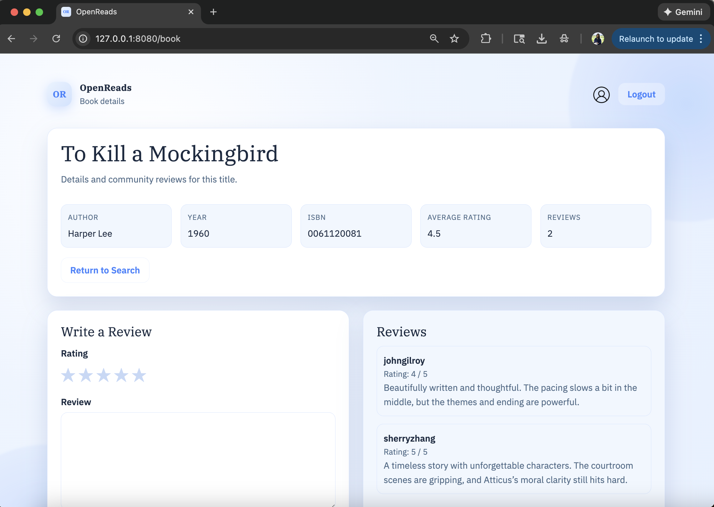

# OpenReads

OpenReads is a book review application that lets users create accounts, search for books, view book details, submit reviews, and view a personal profile. It also supports a JSON-style response via `/api/books/<isbn>` using the Google Books API.

***NOTE**: Originally built in 2023, updated in 2026 with backend fixes and a more polished, modern UI. The update focused on correctness, consistency, and visual quality without changing the core feature set.*



## Features
- User registration and sign in
- Search by ISBN, title, or author
- Book detail page with OpenReads ratings and reviewer details
- Profile page with review summary and recent activity
- One review per user per book
- API route for book info

## Technologies
- **Languages:** Python, SQL, HTML, CSS
- **Frameworks/Libraries:** Flask, Flask-Session, SQLAlchemy, Bootstrap
- **Database:** PostgreSQL
- **API:** Google Books API

## Setup
1) Create and activate a virtual environment.
2) Install dependencies:
```
pip install -r requirements.txt
```
3) Set environment variables (optional defaults are provided in `app/config.py` and loaded via `python-dotenv`):
```
export SECRET_KEY="your-secret"
export DATABASE_URL="postgresql://localhost/your_db"
```
4) Create tables:
```
psql -d your_db -f db/schema.sql
```
5) Load sample data (optional):
```
python scripts/import_books.py
```
6) Run the app:
```
python application.py
```
7) Open the app in your browser:
```
http://localhost:8080
```

## Usage
1. Register an account on the home page.
2. Sign in to access search and reviews.
3. Search by ISBN, title, or author and open a book.
4. Submit a review and rating; your profile summarizes your activity.

## API
`GET /api/books/<isbn>` returns Google Books data for ISBNs in the local database.

Example:
```
GET /api/books/0380795272
```

If the ISBN is not in the database, the endpoint returns a 404 error.

## Tests
Currently includes a small unit test suite.

```
pytest
```
