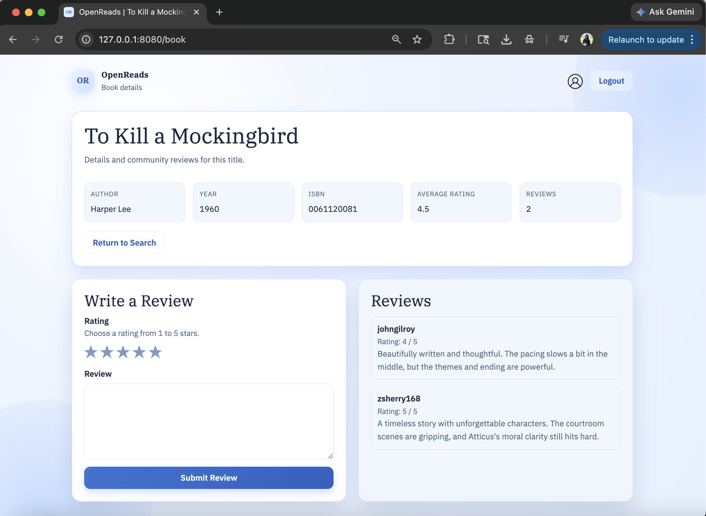
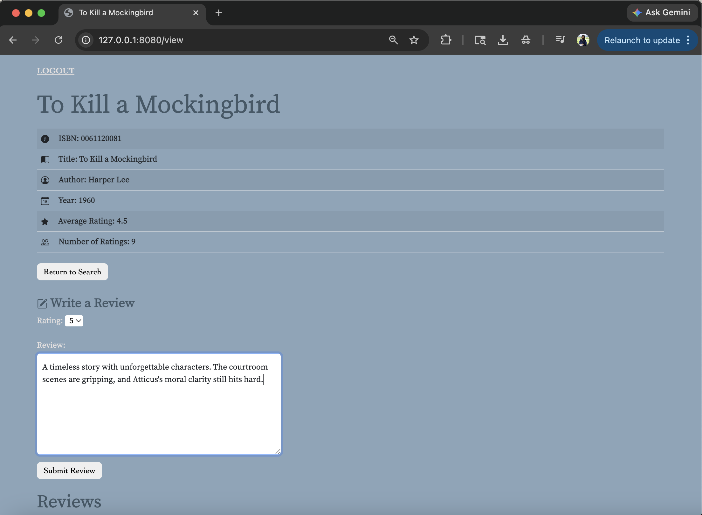

# OpenReads

OpenReads is a book review application where users can create accounts, search for books, view book details, submit reviews, and manage a personal profile. It also includes a Google Books API-backed route at `/api/books/<isbn>`.

***NOTE**: Originally built from scratch in 2023. In 2026, I used AI-assisted development tools to help refactor, modernize, and improve parts of the codebase, including backend fixes and a more polished UI. The architecture, product decisions, and final implementation choices remained mine.*

### Current Version


### Original Version


The refreshed version introduces a redesigned interface, a new profile page, backend and architecture improvements, and accessibility and usability enhancements across the app.

## Features
- Account creation and sign in
- Book search by ISBN, title, or author
- Book detail pages with ratings and reviews
- User profile with review history and activity
- One review allowed per user per book
- Google Books API integration

## Technologies
- **Languages:** Python, SQL, HTML, CSS
- **Frameworks/Libraries:** Flask, Flask-Session, SQLAlchemy, Bootstrap
- **Database:** PostgreSQL
- **API:** Google Books API

## Setup
1) Create and activate a virtual environment.
2) Install dependencies:
```
pip install -r requirements.txt
```
3) Set environment variables (`SECRET_KEY` and `DATABASE_URL` have optional defaults in `app/config.py`; values are loaded via `python-dotenv`):
```
export SECRET_KEY="your-secret"
export DATABASE_URL="postgresql://localhost/your_db"
export GOOGLE_BOOKS_API_KEY="your-api-key"  # optional
```
4) Create tables:
```
psql -d your_db -f db/schema.sql
```
5) Load sample data (optional):
```
python scripts/import_books.py
```
6) Run the app:
```
python application.py
```
7) Open the app in your browser:
```
http://localhost:8080
```

## Usage
1. Register an account on the home page.
2. Sign in to access search and reviews.
3. Search by ISBN, title, or author and open a book.
4. Submit a review and rating; your profile summarizes your activity.

## API
`GET /api/books/<isbn>` attempts to fetch book data directly from Google Books for the provided ISBN.

Example:
```
GET /api/books/0380795272
```

If Google Books data is unavailable, the route shows an error message.

## Known Limitations
- Search only supports one field at a time and is limited to the local books dataset.
- `/api/books/<isbn>` renders an HTML page instead of returning pure JSON.
- The project still uses a small-project structure, with most route logic in one file and limited automated test coverage.

## Tests
Currently includes a small test suite covering smoke tests, Google Books service behavior, and template accessibility checks.

```
pytest
```
